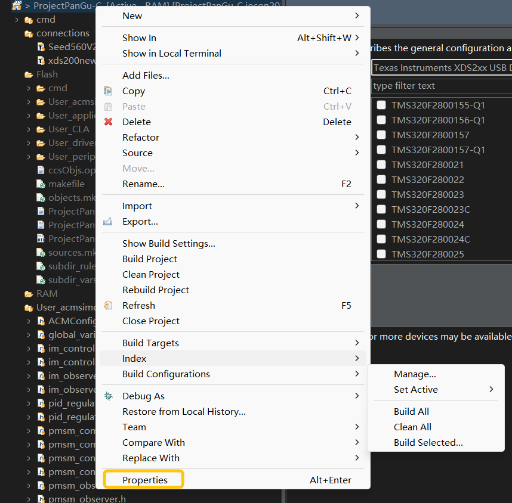
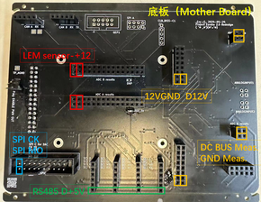
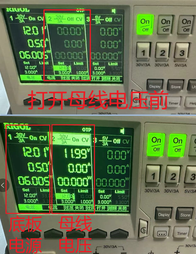

# ProjectEureka! README


# Introduction

This is a general purpose multi-three-phase motor drive.

The drive has been used to build a maglev system and bipedal robots.

**Codes** from ProjectPanGu-C: https://github.com/horychen/ProjectPanGu-C/tree/dev-zjl

ProjectPanGuCpu2: https://github.com/horychen/ProjectPanGuCpu2/tree/boandyanCpu2

**Hardware** from ProjectEureka: https://github.com/horychen/ProjectEureka/tree/insider

# 硬件测试

## 电源测试

首先我们需要一块底板的电源板，电源的PCB版本可以用Altium Designer打开查看详情，而拿到电源板之后第一件事是要单独测定在DC12V供电下，电源板的输出是否正常。

输出如下图为 1. +12V 2. -12V 3. 12GND 4. A-5V 5. AGND 6. A12V 7. A+5V 8.AVDD(3.3V) 9. D+5V

其中正负12V的地是12GND，剩余的输出的地是AGND。完成输出的测试确认没有问题之后则可将电源板插在底板上。


## 底板测试

注意把电源板插上底板的时候一定要注意对准+12V，


同时要插上DSP与Emulator（仿真盒XDS200ISO），我们所用的DSP是TMS320F28377D


底板接上Emulator（仿真盒）和DSP之后，我们可以给电源板供电观察DSP与电源板是否亮灯，亮灯则说明DSP与电源板正在工作了。Emulator（仿真盒）的作用是建立DSP和电脑的联系，并使用[CCS](https://www.ti.com.cn/tool/cn/CCSTUDIO)(Code Composer Studio)来进行一些实时的调试。


这时我们使用CCS来烧录程序，首先打开CCS，配置CCS。

## 配置CCS环境（从头开始）

### Win10环境下

- 比较麻烦，推荐你直接用win11
- 吴波用的也是win10，我之后写下win10怎么用ccs连接Seed 560V2，PS：可能需要修改BIOS设置（如果用的是560黑色仿真盒，4000多的那个）

### Win11环境下

1. 从官网https://www.ti.com.cn/tool/cn/download/CCSTUDIO或者NAS（mmlab的网络存储/home/Software）上下载CCS的安装包，CCS12.7.1.00001_win64
2. 安装第一次打开，会出现选择workspace，此处可以选择一个新建的空文档，此文件夹名字以及所在路径不能包含中文名。选择一个新建的空文档是不是也可以？请不要把运行的代码放在你的workspace下


3. 打开你要运行的project（这里以pangu-c为例）。点击File- Open Files from Project，出现下面界面，选择相应的project，点击Finish


4. 选中需要设置的文件，对于我们的ProjectPanGu-C和pangucpu02来说，需要将这两个文件都修改，打开文件的properties，设置project的Build属性，点击Manage Configuration，选中Flash之后，点击Set Active，在Configuration下拉菜单中选中Flash [Active]，Apply and Close，生成烧录到Flash中的文件，默认值是RAM。烧录到RAM和烧写到Flash中的配置会有不同，主要区别在于.cmd文件。烧录到RAM，掉电之后，程序不会保存在DSP中。烧录到Flash中，掉电之后，程序仍然保存在DSP中。pangucpu02同理。




5. 选择Debug Configuration 设置不同CPU（即CPU01和CPU02）要烧录的.out文件。首先，在main里面可以关闭Debug界面中的CPU1_CLA1和CPU2_CLA1，之后选择Program，点击Project的Workspace，选中ProjectPanGu-C，点击Program的Workspace，选中在ProjectPanGu-C\Flash\ProjectPanGu-C.out，CPU02同理。


6. 在相应文件中找到connection里面的xds200new.ccxml并点击，在Basic的Connection中找到你使用的Emulator（仿真盒）对应的型号。Board or Device中找到TMS320F28377D（我们采用的DSP具体型号）并点击右侧的Test Connection。验证Emulator（仿真盒）和电脑连接成功，得到结果如图。


7. 先将两个文件ProjectPanGu-C和pangucpu02都Build（就是点击文件之后在点击界面上的小锤子），接着使用Debug，点击绿色小虫子并选择我们之前设置好的Debug Configuration，烧录开始后会用一个进度条，烧录之后会进入一个Debug界面


8. 可以在Window\Show View下找到各种窗口


## 电流传感器测试

首先，需要将电机、通讯、逆变器的板子全都接到底板上面，一些有助于连接各个板子的引脚定义已经给出，如下面的图。其中LEM电流传感器上面的箭头表示对于LEM电流传感器来说的电流正方向，电机的动力线的电流方向理应与其对应。




我们要测试的就是电流传感器，将程序烧录后，进行如图操作，若CPU1_CLA1和CPU2_CLA1已不在则不需要删除。


在Main.c中先找到这几行代码，可以看到各相电流iuvw[]和vdc是如何计算出来的，其中绿色部分是电流传感器测得的，红色部分是我们用来矫正的。需要注意的是，vdc是有AdcaResultRegs.ADCRESULT0和AdcaResultRegs.ADCRESULT6（现被注释），两个定义的需要通过通过开关母线电压观察AdcaResultRegs.ADCRESULT0和AdcaResultRegs.ADCRESULT6（现被注释）的变化来确定Axis.vdc计算所使用的ADCRESULT。另外，AdcaResultRegs.ADCRESULT的值波动是很正常的，主要还是找到存在时间比较长的值。


直流母线电压的offset和scale可以通过电压源电压的计算：

开关电压源得到结果如下，发现AdcaResultRegs.ADCRESULT0的值从8变成了70，母线电压由0v变成了12v。

则adc_offset为8，adc_scale=(70-8)/12=0.1935，若觉得不够准确可以多取几个点使用最小二乘法确定。最后，将计算所得的值填入OFFSET_VDC_BUS_IPM1和SCALE_VDC_BUS_IPM1




相电流的offset和scale的计算有两种方法：

1. 如果没有电流探头：

   a. 使用漆包线穿过LEM若干圈，用鳄鱼夹将直流电源接在漆包线两端，电源设置成电流源模式（此处将通道二短接在一起，设置一个电压限幅，同时设置给定一个电压和电流，电源则变为电流源模式），使漆包线上能通过指定大小的电流。电流沿着电源的正极往负极流动，穿过LEM传感器的洞，我们需要保证电流方向与LEM上的箭头方向一致。

   

   ​	根据PCB，找出当前LEM与dsp内哪一路AdcResult对应，并在watch window（Expressions窗口）中加入对应Adc[a/b/c/d]ResultRegs.ADCRESULT[1~16]变量。改变直流电源输出（0.1A、0.2A......），记录下ADCRESULT的值，构成一个2*n的矩阵，用最小二乘法或者 mmlab 组内可使用 biaoding.m脚本（D:\_ym bearing\biaoding.m）算出ADC_OFFSET和ADC_SCALE（注意漆包线缠了几圈）。最后，将ADC_OFFSET和ADC_SCALE写进代码后（填写时注意代码的一一对应），控制直流电源在漆包线中输出给定电流，观察中是否能够读出对应的电流值。

   ​											

   

   

2. 如果有电流探头：

检查IPM输出端子的动力线、穿过ADC（LEM电流传感器的洞）、与电机端子相连接，这一套的连线是否与dsp的代码保持一致（iuvw有两组分别为0、1、2和3、4、5以及所对应的相）：

- a.首先需要检查电流探头是否存在偏置，见下图，电流探头存在偏置，需要调零。找到电流探头的另一头，它正与录波仪的通道口相接，转动调零旋钮至显示的值为零。


- b. 需要检查逆变器的每一相都可以正常工作，同时确定每一相的位置，将Axis_1.Select_exp_operation设置为5，使得IPM输出电压可以手动设定。轮流给定CTRL_1.svgen1的Ta、Tb、Tc的值为0.6、0.5、0.4，并观察Axis_1.iuvw[0/1/2]的正负值。例如：Ta=0.6，Tb=0.5，Tc=0.4，那么电流理论上会从A相流出，C相流入，那么，表示A相电流的Axis_1.iuvw[0]应为正数，表示B相电流的Axis_1.iuvw[1]应约等于0，表示C相电流的Axis_1.iuvw[2]应为负数。不断调整Ta、Tb、Tc的值，确保每一相都通过测试。如果实验现象不正确，需要调整接线方式（调换动力线与LEM、IPM端子的对应关系，尽量不要修改代码）。同样，可以通过修改CTRL.svgen1的Ta、Tb、Tc的值来赋予电流确定所使用的电流传感器和逆变器是否对应。另外，测试时要打开开关。如下图


- c. 在检查完检查逆变器的每一相都完好，同时确定每一相的位置之后，将开关关闭，先获取没有任何电流时的AdcaResultRegs的值填入OFFSET中，这时候可以看到AdcaResultRegs.ADCRESULT1的值为2025。之后，Axis_1.Select_exp_operation设置也为5，再给定CTRL.svgen1的Ta、Tb、Tc的值为0.6、0.5、0.4，此时逆变器会给出电流，电流探头所得的电流值为0.857A，这时候可以看到AdcaResultRegs.ADCRESULT1的值为2052，则这一相的scale为 0.857/(2052-2025)=0.3174。同样的由于硬件中同样存在噪声，得到的，若觉得不够准确可以多取几个点使用最小二乘法确定。


 下图为逆变器给出电流后


根据以上方法可以将两个电流传感器的每一相都校正，使得测出来的电流较为准确。最后，要将计算所得的值填入，保存并重新烧录。


其中Select_exp_operation为5的效果是直接根据Ta、Tb、Tc，给定PWM波。


## 电机和逆变器的测试

在电流传感器测试中我们已经检查过逆变器每一相的好坏了，接下来

1. 将Axis_1.Select_exp_operation改回0，设置如下vvvf代码（可在代码里直接修改或者在expressions中修改）：
   ```SQL
   REAL vvvf_voltage = 2;
   REAL vvvf_frequency = 5;
   REAL enable_vvvf = TRUE;
   ```

   

   

   闭合开关，观察电机是否能转起来（此时电流环pid的给定与反馈肯定对不上，不用管），不能转的话，检查EPwm[1/2/3/4/5/6]Regs.CMPA.bit.CMPA变量是否正常。之前有一个bug，是单套逆变器运行，切换运行的逆变器后，上一个逆变器的CMPA值没有复位为2500（2500代表输出0V，200与4800代表输出最大负与最大正电压），导致直流电源过流。

   如果两个电机都在已连接则两台电机都会转动。

   

2. **检查编码器读数**
   
   将代码运行起来，不运行电机，用手推动电机轴，观察watch window（expressions）（确保打开自动刷新）中电机的编码器读数是否正常（Read.SCI_knee_position_elec, Read.SCI_hip_position_elec)命名是基于腿组的（position_count_[SCI_knee/SCI_hip/CAN_ID0x01/CAN_ID0x03]_fromCPU2）。
   
   
   
   
   
   若不正常，请检查连线
   
3. **测试电流环**

​	记得关闭enable_vvvf，设置positionLoopType = 0（不进行位置环控制），use_first_set_three_phase = 1（仅使用IPM1），需要注意Axis_1、CTRL_1为新代码Axis、CTRL为老代码。令flag_overwrite_theta_d = 1的效果是通过DSP给定一个不断增大的内部角度。此时，没有使用编码器所得的信息。

```C
Axis_1.flag_overwrite_theta_d = 1;         // 使用内部给定角度代替码盘位置反馈
Axis_1.Overwrite_Current_Frequency = 0;    // 内部给定角度不变化
Axis_1.Set_current_loop = 1;                // 手动给定电流环输入，不使用速度环输出
Axis_1.Set_manual_current_id = 0;            // 手动给定id的设定值=0
Axis_1.Set_manual_current_iq = 0;            // 手动给定iq的设定值=0
```


 将逆变器的拨动开关打开，观察CTRL_1.S->iD与CTRL_1.S->iQ结构体中的Ref、Fbk等变量，以及直流电源的电流输出值。如果电流反馈值Fbk能够跟踪电流给定值Ref，则说明电流环部分代码正确。

​     同样，然后设置use_first_set_three_phase = 2，测试IPM2的逆变器-电机系统。

4. **测试编码器读数与电流环**

   设置positionLoopType = 0（不进行位置环控制），use_first_set_three_phase = 1（仅使用IPM1）。此时，没有使用编码器所得的信息。

   ```C
   Axis_1.flag_overwrite_theta_d = 1;         // 使用内部给定角度代替码盘位置反馈
   Axis_1.Overwrite_Current_Frequency = 3;    // 内部给定角度以3Hz变化
   Axis_1.Set_current_loop = 1;                // 手动给定电流环输入，不使用速度环输出
   Axis_1.Set_manual_current_id = 0;            // 手动给定id的设定值=0
   Axis_1.Set_manual_current_iq = 1;            // 手动给定iq的设定值=1A
   ```

   

   设置一个较小的iq值，让电机产生电磁转矩，给定一个不断增大的内部角度。打开波动开关，逆变器产生一个旋转电压，让电机开环转起来。此时观察绝对式编码器读数。position_elec_SCI_hip_fromCPU2此时是不断减小的。同时，iM和iT的Fbk能可以跟上Ref，同时Err也不会太大。

   

   

   如果iM和iT的Fbk跟不上Ref，同时Err特别大，或者iT的Ref和Fbk都特别大，那么一定要检查以下内容，注意等号后面的正负号：注意（position_count_[SCI_knee/SCI_hip]_fromCPU2），会不断增大还是不断减小。由于舞肌的SCI编码器不能设置旋转方向，需要在代码中决定，是采用

   

   

   ```C
   // 膝盖电机，正转电流导致编码器读数减小：
   CTRL->enc->encoder_abs_cnt = - ( 
                                   (int32)position_count_SCI_fromCPU2 - 
                                   CTRL->enc->OffsetCountBetweenIndexAndUPhaseAxis 
                                   );
   ```

还是

```C
// 大腿电机，正转电流导致编码器读数增大
CTRL->enc->encoder_abs_cnt =   ( 
                                (int32)position_count_SCI_fromCPU2 - 
                                CTRL->enc->OffsetCountBetweenIndexAndUPhaseAxis 
                                );
```

然后设置use_first_set_three_phase = 2，测试IPM2的逆变器-电机系统

最后，闭环运行电流环，使用编码器所得信息，设置如下：

```JSON
Axis_1.flag_overwrite_theta_d = 0;         
Axis_1.Overwrite_Current_Frequency = 0;    
Axis_1.Set_current_loop = 1;                // 手动给定电流环输入，不使用速度环输出
Axis_1.Set_manual_current_id = 0;            // 手动给定id的设定值=0
Axis_1.Set_manual_current_iq = 2;        
```

iq电流过小可能电机不会运行，是正常现象。

5. **测量编码器零位**

在测试位置环之前我们需要找出编码器零位，如果出现电机转动“肌无力”，用手一握，电机就停止转动，就要重新校正编码器零位。所用的编码器是绝对值编码器，所用的通讯协议是RS485。

参考https://www.bilibili.com/video/BV17m411278e/?spm_id_from=333.999.0.0&vd_source=ce51d023cad3329e9a2be0e2658453ac

设置use_first_set_three_phase = 1（仅使用IPM1）则是测试第一套逆变器连接的电机的编码器零位。

```JSON
Axis_1.flag_overwrite_theta_d = 1;         // 使用内部给定角度代替码盘位置反馈
Axis_1.Overwrite_Current_Frequency = 0;    // 内部给定角度以3Hz变化
Axis_1.Set_current_loop = 1;                // 手动给定电流环输入，不使用速度环输出
Axis_1.Set_manual_current_id = 3;            // 手动给定id的设定值=0
Axis_1.Set_manual_current_iq = 0;            // 手动给定iq的设定值=1A
```

6. **测试速度环**

先将以下设置改为零，


新代码中需要确定positionLoopENABLE的值，电机组的代码中positionLoopENABLE的设置被注释掉了，任意值都可以。


如果iM和iT的Fbk跟不上Ref，同时Err特别大，或者iT的Ref和Fbk都特别大，那么一定要检查之前CTRL->enc->encoder_abs_cnt 是如何获得的（在**测试编码器读数与电流环**这一节中）。设置Set_manual_rpm的值，确定速度环的给定。


## DAC测试

 打开ShareMemory.c，在expressions中修改Axis.channels_preset的值可以选择要显示的八个变量，expressions中Axis.channels_preset被修改后会重新变回0，属于正常现象。


为了测试DAC的八个通道都可以工作，可以将蓝框中的代码用上，重新烧录后，八个通道应该都可以输出正弦波。


下图为DAC正常工作时的波形图，此时Axis.channels_preset为1，显示的是Axis.iuvw[0]×0.2、Axis.iuvw[1]×0.2、Axis.iuvw[2]×0.2；此处乘上0.2是由于DAC输出的值是有限的，将变量变小后输出可以拥有更大显示上下限。